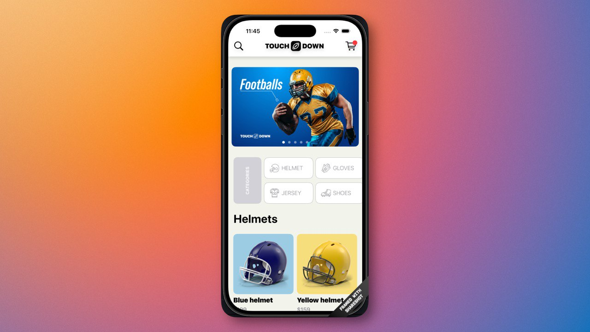

# Touchdown - E-Commerce App

**Touchdown** é uma aplicação de e-commerce moderna desenvolvida em SwiftUI para iOS. O projeto foca em uma experiência de usuário fluida para compras de artigos esportivos, especificamente capacetes e acessórios relacionados.

## 🚀 Funcionalidades

- **Navegação Intuitiva**: Interface limpa com scroll vertical e horizontal para categorias e marcas.
- **Grade Dinâmica**: Visualização de produtos em uma grade flexível.
- **Detalhes do Produto**: Visualização detalhada ao selecionar um item.
- **Feedback Háptico**: Uso de `UIImpactFeedbackGenerator` para melhorar a experiência táctil.
- **Categorias e Marcas**: Filtros visuais por categoria e logotipos de marcas.
- **Design Responsivo**: Adaptado para diferentes tamanhos de tela do iPhone.

## 🛠 Tecnologias e Padrões

- **Linguagem**: Swift
- **Interface**: SwiftUI
- **Arquitetura**: MVVM (Model-View-ViewModel) básico.
- **Persistência de Dados**: JSON local carregado via Bundle extension.
- **UX**: Haptic Feedback.

## 📂 Estrutura do Projeto

O projeto está organizado da seguinte forma:

- **App**: Contém os pontos de entrada do aplicativo e as views principais (`ContentView`).
- **Data**: Arquivos JSON com os dados de produtos, categorias, marcas e banners.
- **Model**: Definições de estruturas de dados (`Product`, `Category`, `Brand`, `Player`).
- **View**: Componentes reutilizáveis da interface (Grids, Botões, Itens, etc.).
- **Utility**: Constantes do projeto, cores personalizadas e utilitários de animação/forma.
- **Extension**: Extensões úteis para facilitar o desenvolvimento (ex: decodificação de JSON).

## 📥 Como Rodar

1. Certifique-se de ter o **Xcode** instalado (recomendado 15.0+).
2. Clone ou baixe este repositório.
3. Abra o arquivo `gnix_touchdown.xcodeproj`.
4. Selecione um simulador de iPhone.
5. Pressione `Cmd + R` para rodar o projeto.

---

Desenvolvido por **Davi Gomes Florencio**.
